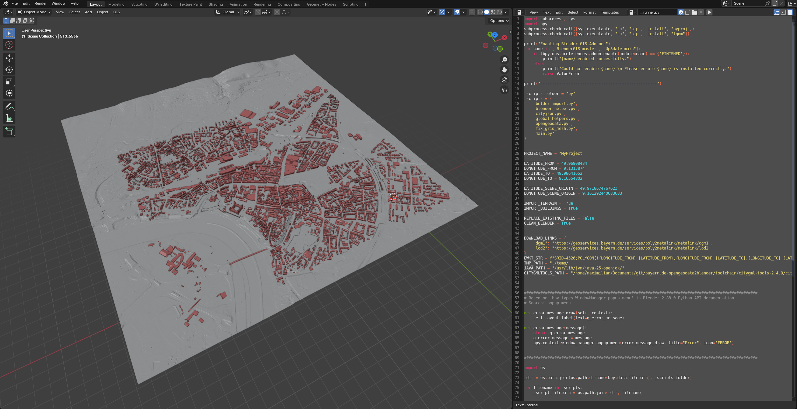
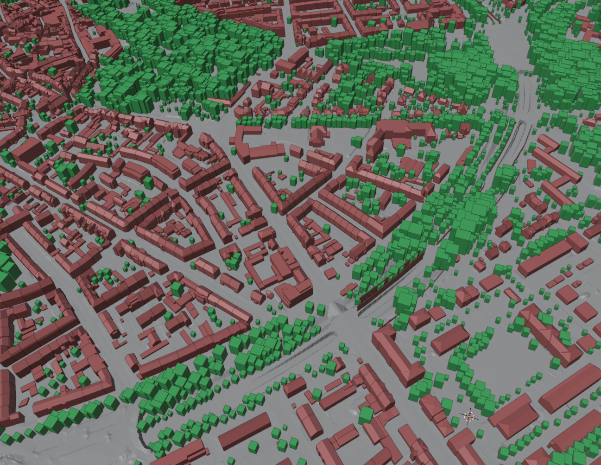

# bayern.de-opengeodata2blender

This collection of scripts simplifies the process of importing map data from [geodaten.bayern.de](https://geodaten.bayern.de/opengeodata/) into a Blender scene.

The scripts fully automate retrieving the metalink files for a specified coordinate range, downloading the required LoD2 and DGM1 files, and importing them into Blender.  
Downloaded files are stored in a temporary folder so that previously downloaded files can be reused.

## Usage

The scripts can be run by opening the `__runner.py` file in Blender’s **Text Editor**.  
If your Blender file is located in the root of this repository, the path to the `./py` folder is already set.  
Otherwise, you’ll need to supply it manually.

Inside the file, the following options can be configured:

| Variable              | Description                                                           |
|-----------------------|-----------------------------------------------------------------------|
| **PROJECT_NAME**      | Name of the project (optional; only affects the Metalink file name)   |

| Variable                      | Description                                               |
|-------------------------------|-----------------------------------------------------------|
| **LATITUDE_FROM**             | Starting coordinate (latitude)                            |
| **LONGITUDE_FROM**            | Starting coordinate (longitude)                           |
| **LATITUDE_TO**               | Ending coordinate (latitude)                              |
| **LONGITUDE_TO**              | Ending coordinate (longitude)                             |
| **LATITUDE_SCENE_ORIGIN**     | Latitude to position Blender’s (0, 0, 0) scene origin     |
| **LONGITUDE_SCENE_ORIGIN**    | Longitude to position Blender’s (0, 0, 0) scene origin    |

| Variable              | Description                   |
|-----------------------|-------------------------------|
| **IMPORT_TERRAIN**    | Import GeoTIFF terrain data   |
| **IMPORT_BUILDINGS**  | Import LoD2 building data     |
| **IMPORT_TREES**      | Import Tree data              |

| Variable                      | Description                                        |
|-------------------------------|----------------------------------------------------|
| **REPLACE_EXISTING_FILES**    | Redownload all files and overwrite any cached ones |

| Variable              | Description                                         |
|-----------------------|-----------------------------------------------------|
| **CLEAN_BLENDER**     | Completely clear the Blender scene before importing |

Make sure the paths to the temporary folder and external tools are correctly set (see **Requirements** for more information).

> **Absolute paths are generally recommended.**

| Variable              | Description                                                           |
|-----------------------|-----------------------------------------------------------------------|
| **TMP_PATH**          | Path to cache already downloaded files                                |
| **JAVA_PATH**         | Path to your Java installation (the full Java folder, not just `/bin`)|
| **CITYGMLTOOLS_PATH** | Path to the `citygml-tools.bat` file                                  |

Other global variables in `__runner.py` are already set correctly and can be left unchanged:

| Variable              |
|-----------------------|
| **DOWNLOAD_LINKS**    |
| **EWKT_STR**          |

| Variable                | Description                                         |
|-------------------------|-----------------------------------------------------|
| **DOWNLOAD_LINK_TREES** | List of all URLs to download the GPKG Files containing the Tree-Data (This has to be done manually because there is no automated way to get a metalink) |

After setting all variables in the runner file, you can run the code. However, before doing so, make sure to save your Blender file and open the system console (Window → Toggle System Console).

While the script is running, the main Blender window may become unresponsive. By opening the console, you can monitor the progress.

Keep in mind that the script may show no output for certain steps for quite some time. Wait at least 10 minutes before assuming it is stuck.

## Requirements

The script has several requirements:

### Blender

The script was tested with **Blender v4.1**.  
Newer versions may work, but at the time of writing, some required plugins were not fully supported in **v4.5**.

The following plugins must be installed and enabled:

- **Up3date** (for importing CityJSON): [GitHub](https://github.com/cityjson/Up3date)  
- **BlenderGIS** (for importing GeoTIFF): [GitHub](https://github.com/domlysz/BlenderGIS)

> To install an add-on in Blender, download the repository as a `.zip` file, then go to **Edit → Preferences → Add-ons → Install from Disk...**, and select the downloaded `.zip`.

### Other Tools

To convert GML files to the CityJSON format, you’ll need the **citygml-tools** utility.  
You can download it from its [GitHub repository](https://github.com/citygml4j/citygml-tools).  

After downloading and extracting the `.zip`, place it in the `./toolchain` folder and set the corresponding path variable (`CITYGMLTOOLS_PATH`) in `__runner.py` to point to `citygml-tools.bat`.

`citygml-tools` requires a Java installation.  
I recommend using an OpenJDK build (for Windows builds, see [jdk.java.net](https://jdk.java.net/)).  
Place the JDK in the `toolchain` folder and update the `JAVA_PATH` in `__runner.py` variable accordingly.

## The Import Process

The script performs the following steps to download and import data:

0. The **runner file** first installs the required Python modules and checks for the necessary Blender add-ons. It then loads the external Python files of this program and starts executing `main.py`.  
---
1. If required, **clear the Blender scene** and **initialize the necessary folder structure**.  
2. **Request the metalink file** from *geodaten.bayern.de* using the generated `EWKT_STR`.  
3. **Parse the metalink file** and **download** the required data files to their corresponding folders.  
4. **Convert** the LoD2 GML files to **CityJSON** format using *citygml-tools*.  
5. **Convert coordinates** from **WGS84** (latitude/longitude) to **UTM32**, a projection in meters optimized for regions in Germany.  
6. **Set the Blender origin** in both *blenderGIS* and the *CityJSON Add-on* according to the calculated values.  
7. **Batch import** the GeoTIFF files.  
8. **Merge the terrain meshes** and **fix seams** (this step can take quite some time).  
9. **Batch import** the CityJSON files.  
10. **Batch import** the GPKG-Tree files.  
11. **Remove unnecessary EMPTY-type objects** created by CityJSON.  
12. **Assign materials** to the buildings, terrain and trees.  
13. **Clean up** all buildings and objects outside the specified area.

## Screenshots

## License
This project is licensed under the MIT licence - see the [LICENSE](./LICENSE) file for details.

